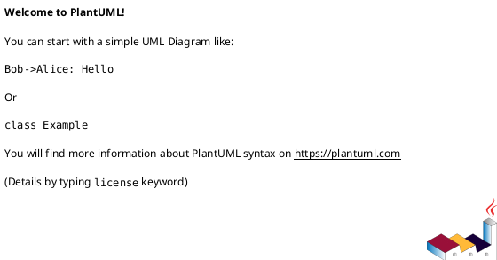

# 技术方案：内容管理（Content Management）

> 文档类型：Technical Design（Epic 级）  
> 适用目录：`docs/epics/E-CMS-001-content-management/`  
> Tech ID：`T-CMS-001`（与 Epic 对齐：`E-CMS-001`）  
> Epic ID：`E-CMS-001`  
> Epic 路径：`EPIC.md`（同目录）  
> 共享上下文：`shared-context.md`（同目录）  
> 全局共享上下文：`docs/epics/global-share-context.md`  
> 附件目录：`tech/`（同目录）  
> 覆盖 PRD：见 §0.1  
> 版本：v0.2  
> 状态：Ready  
> 作者：研发负责人（示例）  
> 日期：2026-01-10  
> 体系说明：`docs/README-PRD体系.md`  
> 设计定稿：`docs/superpowers/specs/<date>-<topic>-design.md`（按项目实际填写）  
> 迭代增量：见 §0.2；模版 `docs/template/技术方案增量模版.md`

---

## 0. 文档索引

### 0.1 覆盖的 PRD

| PRD ID | 标题 | 本方案覆盖范围（实现视角一句话） |
|--------|------|----------------------------------|
| P-001-01 | 内容基本信息 | 聚合根基本信息；创建 / 编辑 API；`contentType` 不可变 |
| P-001-02 | 模块列表与模块框架 | `ContentModule` 多态 payload；富文本 / 图片 / 视频 |
| P-001-03 | 列表与发布下线删除 | `publish` / `offline` / `delete`；发布领域事件；C 端详情投影与 `runtimeStatus` |

### 0.2 迭代增量索引

> **全量本文** = 聚合后的权威契约。迭代变更细节见 delta（勿在本节堆长表）。

| 版本 | 增量文档 | 覆盖 PRD | 一句话 | 状态 |
|------|----------|----------|--------|------|
| v0.2 | [`TECH-DESIGN-delta-v0.2-content-summary.md`](TECH-DESIGN-delta-v0.2-content-summary.md) | P-001-01 | 基本信息新增 `summary`（内容摘要）字段 / API / DDL | Ready |

### 0.3 附件清单

| 附件 | 路径 | 说明 |
|------|------|------|
| 领域模型 | `tech/domain.puml` | PlantUML 类图：Content 聚合 |
| 表结构说明 | `tech/ddl/schema.md` | 表清单、字段、索引；附 `*.sql` 草稿 |
| 时序图 | `tech/sequences/*.puml` | 发布（含订阅联动）、C 端详情 |
| API 文档（可选） | `docs/api-doc/*.html` | 由 backend-prototype 接口段 + `generate-api-doc` 导出；HTTP 字段级权威契约 |
| OpenAPI yaml（废弃） | — | **不再**维护 `tech/openapi/*.yaml` 作为契约 |
| 后端原型（可选） | `demo-backend-service` `feature/<卡号>-…` | 见 §7；**非**业务实现（本方案当前**未做**） |
| 迭代增量（可选） | `TECH-DESIGN-delta-v*.md` | 本轮变更视图；见 §0.2 |

> 字段级 HTTP 契约以 **SpringController + SpringDoc 生成 HTML** 为准（见 §7）；无接口原型时 §5 列表仍可先写，细节待原型补齐。  
> Agent skill：`.agents/skills/epic-prd-tech-design-workflow/backend-prototype/SKILL.md`。

---

## 1. 目标与范围

### 1.1 目标

建成通用内容配置域：内容主数据 + 模块化编排 + 发布生命周期事件 + C 端读模型投影。

### 1.2 In / Out

| 类型 | 内容 |
|------|------|
| In | `demo-content-app` 内 content 域（聚合 / 用例 / API）；3 张新表；2 个 MQ 事件；C 端只读 API |
| Out | 订阅域（notification）内部实现；媒体文件上传与存储服务；C 端页面渲染；调度任务（本 Epic 无） |

### 1.3 与需求文档的分工

| 内容 | 权威来源 |
|------|----------|
| 跨 Epic 术语 / 已有能力 | `docs/epics/global-share-context.md` |
| 业务规则、字段语义、AC | PRD + `shared-context.md` |
| 聚合边界、表、API path、时序、复用（聚合后） | **本文 + `tech/`** |
| 本迭代相对基线的变更清单 | `TECH-DESIGN-delta-v*.md`（见 §0.2） |

冲突时：停止实现，先裁定文档（见体系说明「冲突裁定」）。

---

## 2. 相关上下文（复用与依赖）

### 2.1 必须复用的已有能力

| 能力 | 所在模块 / 路径 | 复用方式 | 备注 |
|------|-----------------|----------|------|
| 统一 Audit Log | `demo-backend-service` 公共审计模块 | 调用 | 表上不重复造操作人字段（只读投影除外） |
| 媒体上传（对象存储） | 通用上传服务 / SDK | 前置上传取 URL，载荷只存 URL | 本域不存文件本体 |
| 订阅配置 SubscriptionConfig | 订阅域（notification） | 发 MQ 事件由订阅域创建/恢复/软删 | subject=`CONTENT`；related_uuid=内容 uuid |

### 2.2 外部依赖与协作

| 依赖方 | 交互方式 | 契约 / 事件 | 失败策略 |
|--------|----------|-------------|----------|
| 订阅域（notification） | MQ | `com.example.events.content.ContentPublished` / `ContentOffline` | 重试 / 告警；本域不补偿订阅行 |
| 对象存储 | SDK | 上传返回 URL | — |

### 2.3 必读代码 / 文档

- `docs/epics/global-share-context.md` — 跨 Epic 术语
- `shared-context.md` §3 — ModuleType / 枚举与对象映射
- 关联 PRD：`prds/P-001-01…03`

### 2.4 明确不复用 / 新建的原因

| 点 | 原因 |
|----|------|
| 新建 `content` 表而非复用旧公告表 | 边界不同：三区结构 + 模块多态 payload，旧模型无 uuid/模块概念 |

---

## 3. 领域模型

### 3.1 说明

- 聚合根：`Content`（id + uuid 双 ID，接口以 uuid 为主）
- 主要实体 / 值对象：`ContentGlobalConfig`（1:1）、`ContentModule`（N，多态 payload）
- 与 `shared-context.md` §3 的映射：Content↔内容；ContentModule↔模块；枚举码值不在本文重定义

### 3.2 PlantUML

源文件：[`tech/domain.puml`](tech/domain.puml)

> 约定：类名与代码/表意图一致；注明聚合边界；不画 UI 组件。

### 3.3 后端领域原型（可选，Phase 4）

> 经人确认后可跑 backend-prototype 领域段：在 `demo-backend-service` 对应 domain lib **仅**落领域数据结构 + `port.in` UseCase 接口签名；完成后回写 §7。**当前未做。**

---

## 4. 数据库表设计

### 4.1 表清单

| 表名 | 说明 | 变更类型 | 关联聚合 / PRD |
|------|------|----------|----------------|
| `content` | 聚合根基本信息（含 v0.2 `summary`） | NEW | Content / P-001-01 |
| `content_global_config` | 内容模板 + `display_config` JSON（分享/订阅开关） | NEW | ContentGlobalConfig / P-001-01 |
| `content_module` | 模块公共行 + payload JSON | NEW | ContentModule / P-001-02 |

权威说明与 DDL：[`tech/ddl/schema.md`](tech/ddl/schema.md)（含 `0xx_create_content.sql`、`1xx_alter_content_add_summary.sql` 草稿）。

---

## 5. API 列表

> 总览表；字段级契约以 SpringController / 生成 HTML 为准（见 §7，当前未做）。

### 5.1 HTTP

| API Path | Method | 业务场景 | 变更类型 | 关联 PRD | 备注（主逻辑 / 变更内容） |
|----------|--------|----------|----------|----------|---------------------------|
| `/api-content/admin/api/v1/contents` | POST | 创建内容基本信息 | 新增 | P-001-01 | 必填/唯一/时间校验；默认模板带出；返回 uuid |
| `/api-content/admin/api/v1/contents/{uuid}` | PUT | 编辑基本信息 | 新增 | P-001-01 | `contentType` 不可变（E-R-002）；v0.2 增 `summary` |
| `/api-content/admin/api/v1/contents/{uuid}` | GET | 内容详情（三区） | 新增 | P-001-01/02 | 基本信息+展示配置+模块列表 |
| `/api-content/admin/api/v1/contents` | GET | 列表筛选分页 | 新增 | P-001-03 | title 模糊 / type / status / 时间区间；updatedAt 倒序 |
| `/api-content/admin/api/v1/contents/{uuid}/modules` | POST | 添加模块 | 新增 | P-001-02 | 类型/模板登记校验；payload 按类型校验 |
| `/api-content/admin/api/v1/contents/{uuid}/modules/{moduleUuid}` | PUT | 编辑模块载荷 / 排序 | 新增 | P-001-02 | 类型/模板锁定；排序交换 |
| `/api-content/admin/api/v1/contents/{uuid}/modules/{moduleUuid}` | DELETE | 删除模块（DRAFT） | 新增 | P-001-02 | 逻辑删除并重排 |
| `/api-content/admin/api/v1/contents/{uuid}/publish` | POST | 发布 | 新增 | P-001-03 | 校验 DRAFT + ≥1 模块；发事件 |
| `/api-content/admin/api/v1/contents/{uuid}/offline` | POST | 下线 | 新增 | P-001-03 | 校验 PUBLISHED；发事件 |
| `/api-content/admin/api/v1/contents/{uuid}` | DELETE | 删除内容（DRAFT） | 新增 | P-001-03 | 级联逻辑删除 |
| `/api-content/public/api/v1/contents/{uuid}` | GET | C 端正式详情 | 新增 | P-001-03 | 仅 PUBLISHED；含 runtimeStatus 与模块投影 |
| `/api-content/admin/api/v1/contents/{uuid}/preview` | GET | Console 预览 | 新增 | P-001-03 | 持 `CONTENT_PREVIEW`；与正式详情同构 |

### 5.2 事件监听（MQ，计入 API 列表）

> Event Type = CloudEvents `type`（schema）；Method 统一填 `MQ`。本域**只生产不消费**。

| Event Type (schema) | Method | 业务场景 | 变更类型 | 关联 PRD | 生产者 → 消费者 | 备注（主逻辑） |
|---------------------|--------|----------|----------|----------|-----------------|----------------|
| `com.example.events.content.ContentPublished` | MQ | 内容发布 | 新增 | P-001-03 | `demo-content-app` → 订阅域（notification） | 消费方创建/恢复订阅（软删恢复，不新建行）并向已订用户推送 |
| `com.example.events.content.ContentOffline` | MQ | 内容下线 | 新增 | P-001-03 | `demo-content-app` → 订阅域（notification） | 消费方对订阅**软删**（写 `deleted_at`），可恢复 |

---

## 6. 主要接口时序图

| 流程名 | 文件 | 对应 API / 场景 | 一句话 |
|--------|------|-----------------|--------|
| 发布（含订阅联动） | [`tech/sequences/publish.puml`](tech/sequences/publish.puml) | POST …/publish | Console → 领域 → MQ → 订阅域恢复订阅 |
| C 端详情 | [`tech/sequences/c-end-detail.puml`](tech/sequences/c-end-detail.puml) | GET …/{uuid} | 校验 PUBLISHED → 聚合读模型投影 → runtimeStatus |

---

## 7. 后端原型与 API 详细设计（契约）

> **目标**：用最少代码把契约钉住。**不是**功能实现。**不再**手写 `tech/openapi/*.yaml`。  
> Skill：`.agents/skills/epic-prd-tech-design-workflow/backend-prototype/SKILL.md`；导出见 `.agents/skills/generate-api-doc/SKILL.md`。

### 7.1 原型契约索引

| 项 | 值 |
|----|-----|
| 后端仓库 | `demo-backend-service` |
| 分支 | 未做 |
| 归属 app / domain lib | `demo-content-app` / `demo-content-lib` |
| 领域模型 / UseCase 接口 paths | 未做 |
| SpringController paths | 未做 |
| Port / DTO paths | 未做 |
| API 文档 HTML | 未导出 |
| 状态 | **未做** |
| 范围说明 | **原型仅契约；业务 Impl / DDL 落地另开实现任务** |

### 7.2 允许 vs 禁止（摘要）

| ✅ 允许 | ❌ 禁止（除非用户明确要求完整实现） |
|---------|--------------------------------------|
| 领域数据结构与 `port.in` UseCase 接口签名 | UseCase Impl |
| SpringController + SpringDoc；DTO `@Schema` | Repository / MyBatis Entity·Mapper·XML |
| Controller 方法体 stub（统一 `UnsupportedOperationException("prototype")`） | Liquibase / 生产库 ALTER（DDL 草稿只写 `tech/ddl/`） |

---

## 8. 前端对接要点

| 项 | 说明 |
|----|------|
| 鉴权 | Console 权限码（`CONTENT_*`）；C 端网关匿名 + 频控 |
| 关键 ID | 对外一律 uuid；禁止依赖内部自增 id |
| 关键错误码 | `CONTENT_NOT_FOUND` / `CONTENT_STATUS_INVALID` / `CONTENT_TITLE_DUPLICATED` → 用户可理解文案 |
| 预览 vs 正式 | `/admin/…/preview`（持 `CONTENT_PREVIEW`）vs `/public/…/{uuid}`；可见性差异见 P-001-03 §7.5 |
| 联调环境 | 本地 `demo-content-app`（端口按项目约定）；前端 `npm run dev` |
| 前端原型（可选） | Epic §0.2 当前「未做」 |

---

## 9. 风险与待决

| 编号 | 项 | 影响 | 状态 |
|------|----|------|------|
| OPEN-001 | 订阅事件 `subject` 字面量需与订阅域确认（`CONTENT` vs 其他） | 发布联调 | Open |
| OPEN-002 | 富文本 HTML 净化策略（XSS 白名单）待安全评审 | 正文渲染 | Open |

---

## 10. AI 实现提示

1. 读取顺序：`EPIC.md` → `shared-context.md` → **本 TECH-DESIGN** → 相关 `TECH-DESIGN-delta-v*` → 相关 PRD → `tech/` 附件。
2. 不发明未在 PRD / shared-context 出现的业务规则；实现名可与业务名映射，但语义不得漂移。
3. 区分原型与实现：未明确「完整实现」时仅可跑 backend-prototype（§7.2 边界）。
4. 改 API：先改 SpringController / SpringDoc（及导出 HTML）与 §5 列表并回写 §7.1，再另开任务写业务 Impl。
5. 改表先改 `tech/ddl/`，再生产 Liquibase（原型阶段不写生产脚本）。
6. 分支命名遵循工作区 Git 约定；前后端同卡同分支名。

---

## 11. 质量门禁（Ready）

- [x] Tech ID / Epic 回链 / 覆盖 PRD 列表完整
- [x] §2 复用与依赖可定位到模块或文档
- [x] `tech/domain.puml` 可渲染，聚合边界清晰
- [x] `tech/ddl/schema.md` 表清单与变更类型齐全
- [x] §5 API 列表齐全（含事件监听 MQ 表）；无原型故标「未做」
- [x] 主流程时序图覆盖关键写路径（发布）与一条读路径（C 端详情）
- [x] §7 三态之一已标明（**未做**）
- [x] §8 前端对接要点足以联调
- [x] 无「业务规则写在技术方案、PRD 未定义」的泄漏
- [x] 未把 backend-prototype 误当成已完成业务实现
